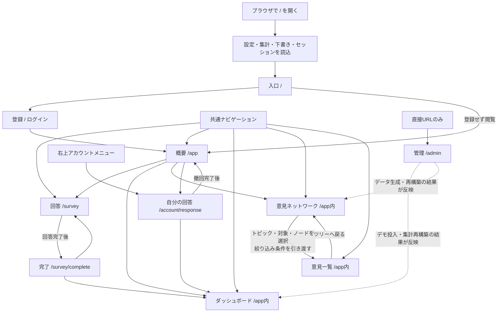
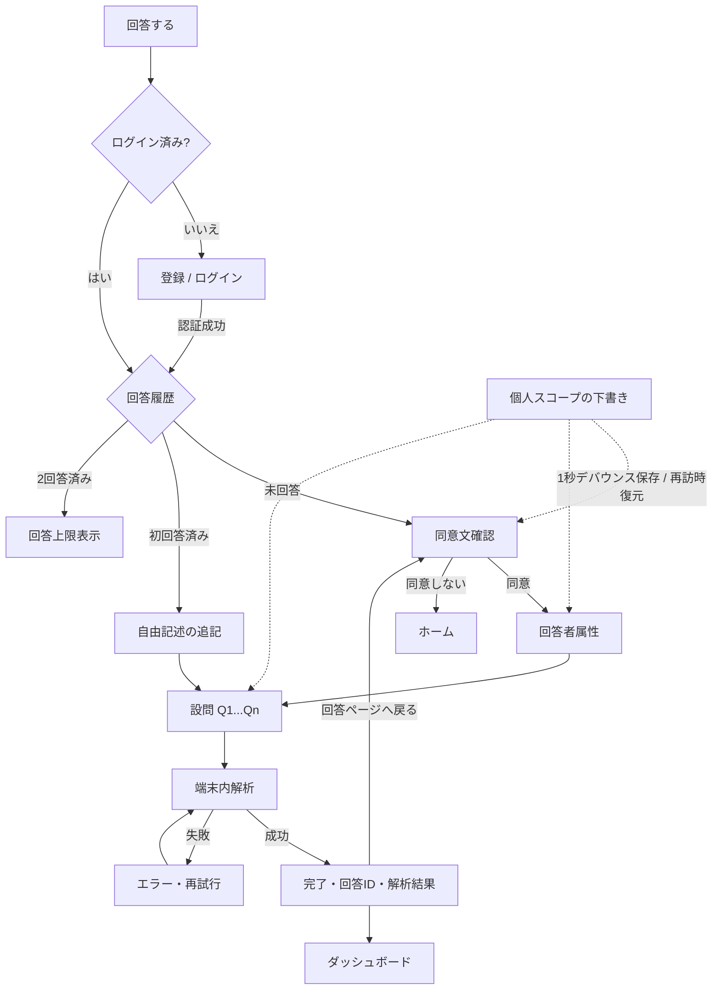
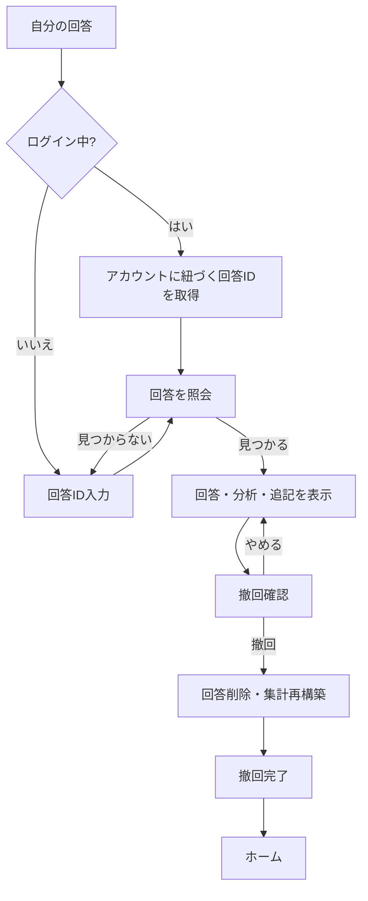
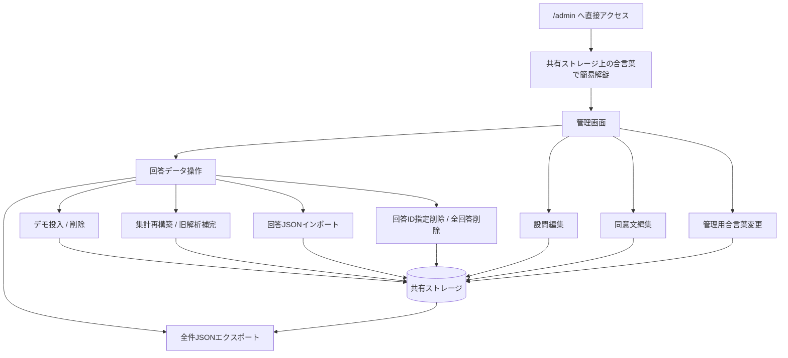
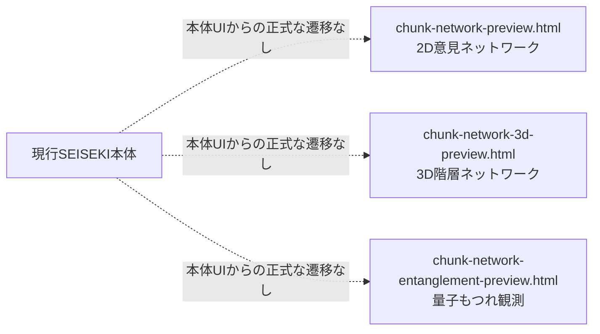

# 現行画面遷移図

作成日: 2026-08-04  
対象: 声析(SEISEKI) v0.15.2 現行プロトタイプ

この資料は将来構想ではなく、`core/ui.jsx` と独立プレビューの現在の挙動を記録する。

図形版: [ページ分離後の画面遷移図](./PAGE-ROUTE-MAP.svg)

## 1. 全体画面

### 現在の遷移方式

- 外部ルーターは追加せず、History APIとReactのviewを同期している。
- 入口、概要、回答、完了、自分の回答、AdminにURLがある。
- 共通ナビゲーションは回答を左端、概要をその次に置く。右上のアカウントメニューから「自分の回答」へ進み、同じページ内で名前・パスワードを変更する。
- ダッシュボード、意見ネットワーク、意見一覧、各ビジュアルは /app 内の表示状態だけを切り替え、ブラウザ履歴へ追加しない。
- 回答途中の入力は従来どおり個人スコープの下書きから復元する。
- 完了画面の再読込では、最後の回答IDから保存済み回答を読み直す。
- 未知のURLは入口 / として扱う。

## 2. 回答フロー

## 3. 自分の回答

## 4. 管理画面

管理画面は一般ナビゲーションと一般画面内の導線から除外した。ただし現行の合言葉は画面上の簡易ロックであり、サーバー側認証・権限分離ではない。現在は一般画面と同じバンドル、同じ実行環境、同じ共有ストレージを使用する。本番では別ビルド化または非搭載とし、Worker側の管理者認可を必須にする。

## 5. 独立プレビュー

- 3画面はいずれも`local/`配下の独立HTMLで、本体の`view`状態には含まれない。
- 量子もつれ画面はクエリ文字列の`count`と`seed`を受け取るが、本体の回答DBを直接参照する正式経路はまだない。
- 現在は開発用プレビューであり、本番画面遷移・認証・認可の対象外である。

## 6. 現行仕様から確認できる課題

1. Adminは一般導線から隔離したが、まだ同じバンドルとストレージ境界にある。
2. Adminの解錠はクライアント側の簡易合言葉で、セキュリティ境界ではない。
3. 本番サーバーでは /survey/* 等をSPAのindex.htmlへ戻すフォールバック設定が必要である。
4. 独立プレビューと本体の間に、認証済みのデータ受け渡し経路がない。
5. 量子観測結果をDBへ保存するか、再計算のみとするかは未確定である。
